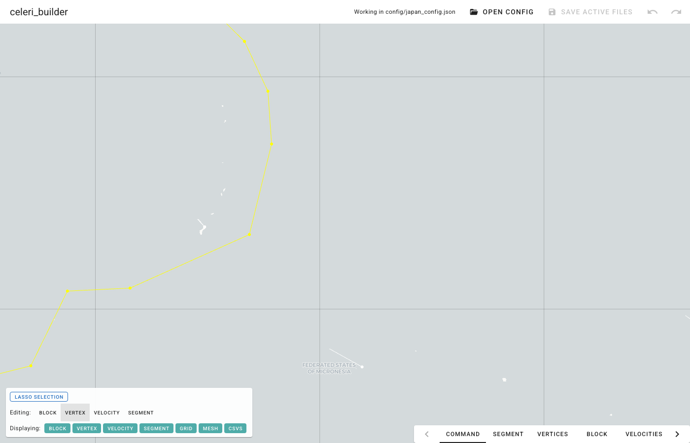

# celeri_builder

Interactive map editor for [`celeri`](https://github.com/brendanjmeade/celeri)
kinematic earthquake cycle model inputs. A Python/[Trame](https://kitware.github.io/trame/)
rewrite of [`celeri_ui`](https://github.com/brendanjmeade/celeri_ui), following
the architecture of [`fennil`](https://github.com/brendanjmeade/fennil).

Edit fault segments (a shared-vertex graph), blocks, station velocities, and
model configuration on a deck.gl map, and round-trip the celeri input files
losslessly.



## Installation

```console
pip install celeri_builder
```

Run the application:

```console
celeri-builder
```

## Mapbox token

Base maps use Mapbox styles when a token is available. Set it in your shell or
in a local `.env` file:

```console
export CELERI_BUILDER_MAPBOX_TOKEN="YOUR_TOKEN_HERE"
```

Without a token the app falls back to a public Carto basemap; with no network
it runs with a blank background (the editor remains fully functional).

## Development setup

```console
uv venv
source .venv/bin/activate
uv pip install -e .
uv sync --all-extras --dev
```

Run tests and linting:

```console
uv run pytest              # fast unit/engine suite
uv run pytest -m ui        # browser UI tests (needs: playwright install chromium)
uv run pytest -m parity    # side-by-side vs celeri_ui (local only)
uv run pre-commit run --all-files
```

## Vendored client assets

`src/celeri_builder/widgets/module/serve/` contains pinned, committed copies of
deck.gl 9.3.6 (`deck.min.js`, MIT) and MapLibre GL JS 5.24.0
(`maplibre-gl.js`/`.css`, BSD-3-Clause) so the app works offline and never
loads code from a CDN.

## Commit message convention

Releases rely on [conventional commits](https://www.conventionalcommits.org/)
via python-semantic-release.

## License

MIT. See [LICENSE](LICENSE).
